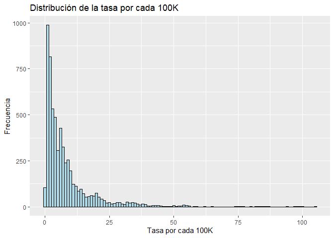
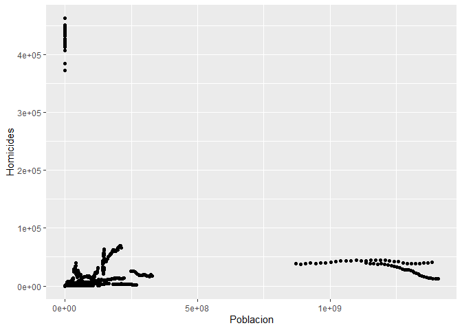

-   **Mostramos un analisis exploratorio de los datos de las tablas
    extraidas para los KPIs sugeridos**

# Carga de data

    df_total <- read.csv('total_mundo.csv')
    df_expulsores <- read.csv('expulsores.csv')
    df_homicidios <- read.csv('homicides100K.csv')
    df_receptores <- read.csv('receptores.csv')
    df_remesas <- read.csv('remesas.csv')

# Homicidios

## Resumen de Homicidios

    summary(df_homicidios)

    ##  Country.Name       Country.Code            Year        Homicides       
    ##  Length:6150        Length:6150        Min.   :1990   Min.   :     0.0  
    ##  Class :character   Class :character   1st Qu.:1997   1st Qu.:    41.0  
    ##  Mode  :character   Mode  :character   Median :2004   Median :   273.0  
    ##                                        Mean   :2004   Mean   :  4151.5  
    ##                                        3rd Qu.:2012   3rd Qu.:   885.8  
    ##                                        Max.   :2019   Max.   :463129.0  
    ##                                                                         
    ##    Poblacion         Tasa.por.cada.100K
    ##  Min.   :0.000e+00   Min.   :0.000     
    ##  1st Qu.:1.025e+06   1st Qu.:1.938     
    ##  Median :5.746e+06   Median :4.944     
    ##  Mean   :3.164e+07   Mean   :  Inf     
    ##  3rd Qu.:2.007e+07   3rd Qu.:9.756     
    ##  Max.   :1.408e+09   Max.   :  Inf     
    ##                      NA's   :90

## Histograma de la columna ‘Tasa.por.cada.100K’

    library(ggplot2)

    # Calcula la media de la columna 'Tasa.por.cada.100K'
    mean_value <- mean(df_homicidios$Tasa.por.cada.100K)

    # Crea un histograma de la columna 'Tasa.por.cada.100K' con línea para la media
    ggplot(df_homicidios, aes(x = Tasa.por.cada.100K)) +
      geom_histogram(binwidth = 1, fill = "lightblue", color = "black") +
      geom_vline(xintercept = mean_value, color = "red", linetype = "dashed") +
      labs(x = "Tasa por cada 100K", y = "Frecuencia") +
      ggtitle("Distribución de la tasa por cada 100K") +
      annotate("text", x = mean_value, y = 10, label = "Media", color = "red")

## Promedio de la tasa de homicidios

    promedio <- mean(df_homicidios$Tasa.por.cada.100K, na.rm = TRUE)
    print(paste("El promedio de Tasa.por.cada.100K es:", promedio))

    ## [1] "El promedio de Tasa.por.cada.100K es: Inf"

## Correlacion entre cantidad de Homicidios y Poblacion

    library(ggplot2)
    ggplot(df_homicidios, aes(x = Poblacion, y = Homicides)) +
      geom_point() +
      xlab("Poblacion") +
      ylab("Homicides")

## Diagrama de Cajas

    library(ggplot2)

    ggplot(df_homicidios, aes(x = "", y = Tasa.por.cada.100K)) +
      geom_boxplot(fill = "lightblue", color = "black") +
      ylab("Tasa por cada 100K") +
      xlab("") +
      ggtitle("Diagrama de Cajas de Tasa por cada 100K") +
      scale_y_continuous(breaks = seq(0, 100, by = 5))

