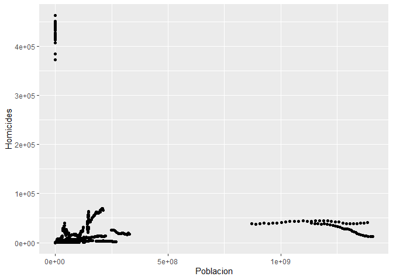
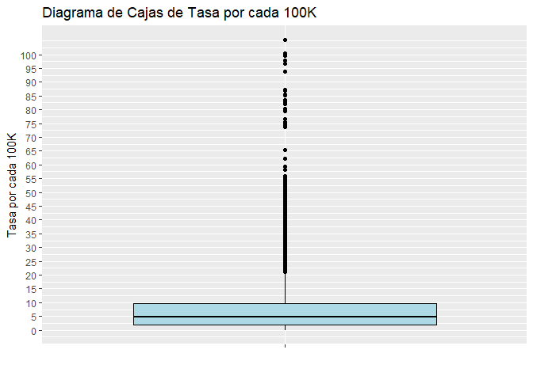
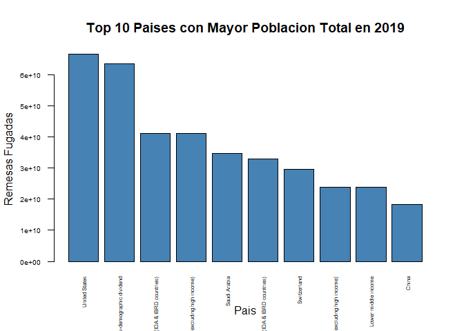
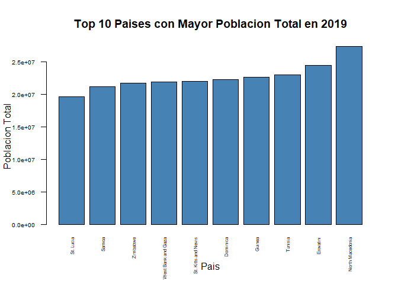
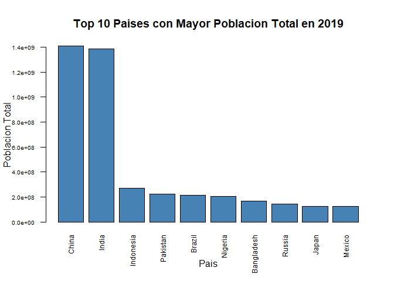
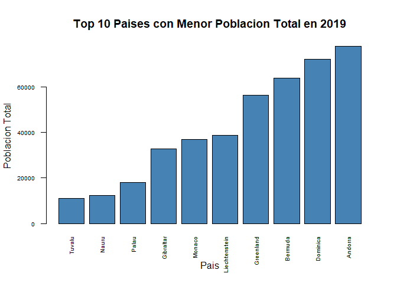

-   **Mostramos un analisis exploratorio de los datos de las tablas
    extraidas para los KPIs sugeridos**

# Carga de data

    df_total <- read.csv('total_mundo.csv')
    df_expulsores <- read.csv('expulsores.csv')
    df_homicidios <- read.csv('homicides100K.csv')
    df_receptores <- read.csv('receptores.csv')
    df_remesas <- read.csv('remesas.csv')

# Tabla de Homicidios

    head(df_homicidios,3)

    ##   Country.Name Country.Code Year Homicides Poblacion Tasa.por.cada.100K
    ## 1  Afghanistan          AFG 2007      3657  25903301           14.11789
    ## 2  Afghanistan          AFG 2008      3785  26427199           14.32237
    ## 3  Afghanistan          AFG 2009      3874  27385307           14.14627

## Resumen del dataframe de Homicidios

    summary(df_homicidios)

    ##  Country.Name       Country.Code            Year        Homicides       
    ##  Length:6150        Length:6150        Min.   :1990   Min.   :     0.0  
    ##  Class :character   Class :character   1st Qu.:1997   1st Qu.:    41.0  
    ##  Mode  :character   Mode  :character   Median :2004   Median :   273.0  
    ##                                        Mean   :2004   Mean   :  4151.5  
    ##                                        3rd Qu.:2012   3rd Qu.:   885.8  
    ##                                        Max.   :2019   Max.   :463129.0  
    ##                                                                         
    ##    Poblacion         Tasa.por.cada.100K
    ##  Min.   :0.000e+00   Min.   :0.000     
    ##  1st Qu.:1.025e+06   1st Qu.:1.938     
    ##  Median :5.746e+06   Median :4.944     
    ##  Mean   :3.164e+07   Mean   :  Inf     
    ##  3rd Qu.:2.007e+07   3rd Qu.:9.756     
    ##  Max.   :1.408e+09   Max.   :  Inf     
    ##                      NA's   :90

## Valores Nulos

    apply(X = is.na(df_homicidios), MARGIN = 2, FUN = sum)

    ##       Country.Name       Country.Code               Year          Homicides 
    ##                  0                  0                  0                  0 
    ##          Poblacion Tasa.por.cada.100K 
    ##                  0                 90

## Valores Duplicados

    sum(duplicated(df_homicidios))

    ## [1] 0

### Para nuestro analisis eliminares los valores ‘inf’ segun la columna ‘Tasa.por.cada.100K’

    # Eliminar filas con valor 'Inf' en una columna específica
    df_homicidios_sin_inf <- subset(df_homicidios, is.finite(df_homicidios$Tasa.por.cada.100K))

## Promedio de la tasa de homicidios

    # Imprimir el nuevo DataFrame sin las filas que contienen 'Inf'
    promedio <- mean(df_homicidios_sin_inf$Tasa.por.cada.100K)
    promedio

    ## [1] 8.090187

## Histograma de la columna ‘Tasa.por.cada.100K’

    library(ggplot2)

    # Calcula la media de la columna 'Tasa.por.cada.100K'
    mean_value <- mean(df_homicidios$Tasa.por.cada.100K)

    # Crea un histograma de la columna 'Tasa.por.cada.100K' con línea para la media
    ggplot(df_homicidios, aes(x = Tasa.por.cada.100K)) +
      geom_histogram(binwidth = 1, fill = "lightblue", color = "black") +
      geom_vline(xintercept = mean_value, color = "red", linetype = "dashed") +
      labs(x = "Tasa por cada 100K", y = "Frecuencia") +
      ggtitle("Distribución de la tasa por cada 100K") +
      annotate("text", x = mean_value, y = 10, label = "Media", color = "red")

## Correlacion entre cantidad de Homicidios y Poblacion

    library(ggplot2)
    ggplot(df_homicidios, aes(x = Poblacion, y = Homicides)) +
      geom_point() +
      xlab("Poblacion") +
      ylab("Homicides")

-   Se aprecia que no existe una aparente correlacion entre ambas
    variables

## Diagrama de Cajas

    library(ggplot2)

    ggplot(df_homicidios, aes(x = "", y = Tasa.por.cada.100K)) +
      geom_boxplot(fill = "lightblue", color = "black") +
      ylab("Tasa por cada 100K") +
      xlab("") +
      ggtitle("Diagrama de Cajas de Tasa por cada 100K") +
      scale_y_continuous(breaks = seq(0, 100, by = 5))

# Tabla de Remesas

    head(df_remesas,3)

    ##   Country.Name Country.Code Year Value
    ## 1  Afghanistan          AFG 1960    NA
    ## 2  Afghanistan          AFG 1961    NA
    ## 3  Afghanistan          AFG 1962    NA

## Resumen Remesas

    summary(df_remesas)

    ##  Country.Name       Country.Code            Year          Value          
    ##  Length:16492       Length:16492       Min.   :1960   Min.   :0.000e+00  
    ##  Class :character   Class :character   1st Qu.:1975   1st Qu.:2.145e+07  
    ##  Mode  :character   Mode  :character   Median :1990   Median :1.980e+08  
    ##                                        Mean   :1990   Mean   :7.055e+09  
    ##                                        3rd Qu.:2006   3rd Qu.:1.771e+09  
    ##                                        Max.   :2021   Max.   :4.608e+11  
    ##                                                       NA's   :7584

## Remesa mayor a que Pais pertenece

    # Encontrar el valor máximo de una columna
    max(df_remesas$Value, na.rm = TRUE)

    ## [1] 460844649359

## Menores Remesas a que Pais Pertenece

    min(df_remesas$Value, na.rm = TRUE)

    ## [1] 0

# Paises de donde salen mayores remesas

    df_remesas <- read.csv('remesas.csv')
    df_remesas <- df_remesas[order(df_remesas$Value, decreasing = TRUE), ]
    remesas_2020 <- subset(df_remesas, Year == 2020)

    # Seleccionar los 10 primeros países con mayor población total
    top_remesas_10 <- head(remesas_2020[18:28,], 10)

    # Crear un gráfico de barras de los 10 primeros países según su población total
    barplot(top_remesas_10$Value, names.arg = top_remesas_10$Country.Name, xlab = "Pais", ylab = "Remesas Fugadas", 
            main = "Top 10 Paises con Mayor Poblacion Total en 2019", col = "steelblue" , las = 2, cex.axis = 0.6 , cex.names = 0.5)

-   Observamos que de estados unidos fugan mas remesas, al igual que
    Arabia Saudita, Suiza y China

# Paises de donde salen menores remesas

    df_remesas <- read.csv('remesas.csv')
    df_remesas <- df_remesas[order(df_remesas$Value, decreasing = FALSE), ]
    remesas_2020 <- subset(df_remesas, Year == 2020)

    # Seleccionar los 10 primeros países con mayor población total
    bottom_remesas_10 <- head(remesas_2020[18:30,], 10)

    # Crear un gráfico de barras de los 10 primeros países según su población total
    barplot(bottom_remesas_10$Value, names.arg = bottom_remesas_10$Country.Name, xlab = "Pais", ylab = "Poblacion Total", 
            main = "Top 10 Paises con Mayor Poblacion Total en 2019", col = "steelblue" , las = 2, cex.axis = 0.6 , cex.names = 0.5)

-   Observamos que los paises mas chicos en territorio suelen emitir
    menores remesas, probablemente al ser un mercado no tan grande no
    suelen tener muchos migrantes que vayan y envien remesas a sus
    familiares en el exterior.

# Tabla de Paises Expulsores

    head(df_expulsores,3)

    ##   Country.Code     Country Year  Migrantes              Diff Poblacion.Total
    ## 1          AFG Afghanistan 1990 -7679582,0 666506,5999999996      10694796,0
    ## 2          AFG Afghanistan 1991 -7013075,4 666506,5999999996      10745167,0
    ## 3          AFG Afghanistan 1992 -6346568,8 666506,6000000006      12057433,0
    ##   Stock.de.Migrantes.cambio.anual....de.Poblacion.Emisor.
    ## 1                                       6,202850081343544
    ## 2                                       6,202850081343544
    ## 3                                       5,527765321192335
    ##   X..Migrantes...Poblacion.
    ## 1        -71,80671795890264
    ## 2        -65,26725364063677
    ## 3       -52,636152321974336

## Resumen de la estructura de la tabla de paises Expulsores

    summary(df_expulsores)

    ##  Country.Code         Country               Year       Migrantes        
    ##  Length:5081        Length:5081        Min.   :1990   Length:5081       
    ##  Class :character   Class :character   1st Qu.:1997   Class :character  
    ##  Mode  :character   Mode  :character   Median :2005   Mode  :character  
    ##                                        Mean   :2005                     
    ##                                        3rd Qu.:2013                     
    ##                                        Max.   :2020                     
    ##      Diff           Poblacion.Total   
    ##  Length:5081        Length:5081       
    ##  Class :character   Class :character  
    ##  Mode  :character   Mode  :character  
    ##                                       
    ##                                       
    ##                                       
    ##  Stock.de.Migrantes.cambio.anual....de.Poblacion.Emisor.
    ##  Length:5081                                            
    ##  Class :character                                       
    ##  Mode  :character                                       
    ##                                                         
    ##                                                         
    ##                                                         
    ##  X..Migrantes...Poblacion.
    ##  Length:5081              
    ##  Class :character         
    ##  Mode  :character         
    ##                           
    ##                           
    ## 

## Paises con mayor poblacion en general en el 2019

    df_expulsores <- read.csv('expulsores.csv')
    # Filtrar los datos para obtener solo los registros de 2019
    df_2019 <- subset(df_expulsores, Year == 2019)
    # Eliminar ',0' al final de los valores en la columna 'Poblacion.Total'
    df_2019$Poblacion.Total <- sub(",0$", "", df_2019$Poblacion.Total)
    # Convertir la columna 'Poblacion.Total' a numérica
    df_2019$Poblacion.Total <- as.numeric(df_2019$Poblacion.Total)

    # Ordenar el dataframe por la columna 'Poblacion.Total' de forma descendente
    df_2019 <- df_2019[order(df_2019$Poblacion.Total, decreasing = TRUE), ]

    # Seleccionar los 10 primeros países con mayor población total
    top_10 <- head(df_2019, 10)

    # Crear un gráfico de barras de los 10 primeros países según su población total
    barplot(top_10$Poblacion.Total, names.arg = top_10$Country, xlab = "Pais", ylab = "Poblacion Total", 
            main = "Top 10 Paises con Mayor Poblacion Total en 2019", col = "steelblue" , las = 2, cex.axis = 0.6 , cex.names = 0.75)

-   Para el 2019 ya ibamos observando la cantidad de poblacion de China
    e India como los mayores paises que poseen una poblacion
    significativamente mas alta en comparacion con los demas paises.

# Tabla de Receptores

    head(df_receptores,3)

    ##   Country.Code     Country Year Inmigrantes               Diff Poblacion.Total
    ## 1          AFG Afghanistan 1990     57686,0  2767,199999999997      10694796,0
    ## 2          AFG Afghanistan 1991     60453,2  2767,199999999997      10745167,0
    ## 3          AFG Afghanistan 1992     63220,4 2767,2000000000044      12057433,0
    ##   Stock.de.Inmigrantes.cambio.anual....de.Poblacion.Receptor.
    ## 1                                       0,0002575297340655568
    ## 2                                       0,0002575297340655568
    ## 3                                      0,00022950158628291814
    ##         X..Inmigrantes
    ## 1 0,005393838274241042
    ## 2 0,005626082870559387
    ## 3 0,005243271930269072

    summary(df_expulsores)

    ##  Country.Code         Country               Year       Migrantes        
    ##  Length:5081        Length:5081        Min.   :1990   Length:5081       
    ##  Class :character   Class :character   1st Qu.:1997   Class :character  
    ##  Mode  :character   Mode  :character   Median :2005   Mode  :character  
    ##                                        Mean   :2005                     
    ##                                        3rd Qu.:2013                     
    ##                                        Max.   :2020                     
    ##      Diff           Poblacion.Total   
    ##  Length:5081        Length:5081       
    ##  Class :character   Class :character  
    ##  Mode  :character   Mode  :character  
    ##                                       
    ##                                       
    ##                                       
    ##  Stock.de.Migrantes.cambio.anual....de.Poblacion.Emisor.
    ##  Length:5081                                            
    ##  Class :character                                       
    ##  Mode  :character                                       
    ##                                                         
    ##                                                         
    ##                                                         
    ##  X..Migrantes...Poblacion.
    ##  Length:5081              
    ##  Class :character         
    ##  Mode  :character         
    ##                           
    ##                           
    ## 

    df_receptores <- read.csv('receptores.csv')
    # Filtrar los datos para obtener solo los registros de 2019
    df_2020 <- subset(df_receptores, Year == 2020)
    # Eliminar ',0' al final de los valores en la columna 'Poblacion.Total'
    df_2020$Poblacion.Total <- sub(",0$", "", df_2020$Poblacion.Total)
    # Convertir la columna 'Poblacion.Total' a numérica
    df_2020$Poblacion.Total <- as.numeric(df_2020$Poblacion.Total)

    # Ordenar el dataframe por la columna 'Poblacion.Total' de forma descendente
    df_2020 <- df_2020[order(df_2020$Poblacion.Total, decreasing = FALSE), ]

    # Seleccionar los 10 primeros países con mayor población total
    bottom_10 <- head(df_2020, 10)

    # Crear un gráfico de barras de los 10 primeros países según su población total
    barplot(bottom_10$Poblacion.Total, names.arg = bottom_10$Country, xlab = "Pais", ylab = "Poblacion Total", 
            main = "Top 10 Paises con Menor Poblacion Total en 2019", col = "steelblue" , las = 2, cex.axis = 0.6 , cex.names = 0.6)

-   Paises como Tuvalu, Nauru y Palau aparecen como los que tienen menor
    poblacion en este grafico, siendo paises de Oceania, que en
    resumidas cuentas son islas muy chicas territorialmente que poseen
    poblaciones muy reducidas.
